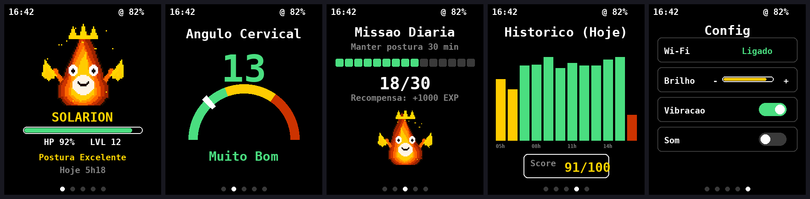
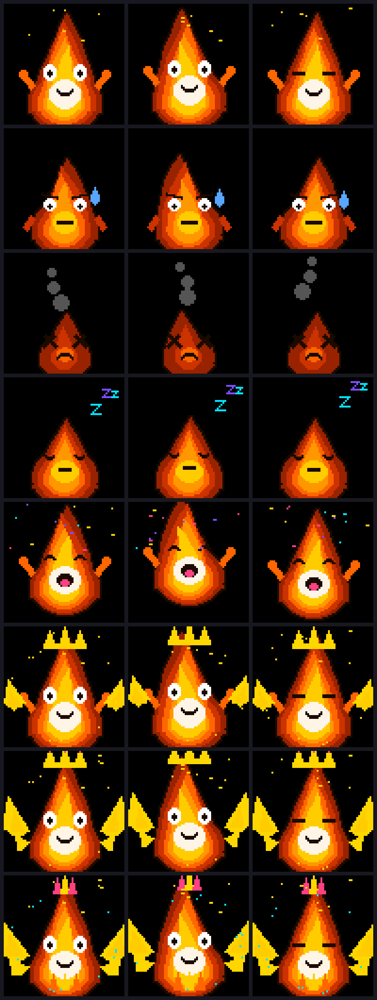

# 🔥 Ergo'Gotchi

**A chama vive da tua postura. Alimenta-a com ergonomia.**

Ecossistema híbrido de monitorização ergonómica com gamificação estilo Tamagotchi:
um **colar wearable** (ESP32-C6 + AMOLED 1.8") mede o ângulo cervical com IMU,
e uma **web app** (desktop/mobile) usa a câmara com MediaPipe para análise
postural em tempo real — a correr 100% no browser, sem servidor.



## 📱 App

**➜ Abre a app aqui: `https://<o-teu-user>.github.io/<repo>/`**

- Visão computacional (MediaPipe Pose) local no browser — nada sai do dispositivo
- Skeleton em tempo real, ângulo cervical, gauge, histórico 6h, distribuição
- Jogo com as mesmas regras do colar: HP, EXP, missão diária, evolução
  EMBER → SOLARION (30d) → GUARDIAN (90d) → PHOENIX (180d)
- Alertas sonoros escalonados + vibração (telemóvel)
- Instalável: no telemóvel, "Adicionar ao ecrã principal"
- Liga-se ao colar físico pela rede local (Config → Ligação ao colar)

## ⌚ Firmware do colar

Pasta [`firmware/ErgoGotchi/`](firmware/ErgoGotchi/) — Arduino para
**Waveshare ESP32-C6-Touch-AMOLED-1.8**: 5 ecrãs com swipe, 8 estados de
sprite (48 KB, 4-bit), sons pelo altifalante ES8311, servidor HTTP para
receber o ângulo da câmara. Instruções no
[README do firmware](firmware/ErgoGotchi/README.md).



## Arquitetura

```
┌─ App (browser + câmara) ──POST /api/camera──► ┌─ Colar ESP32-C6 ─┐
│  MediaPipe · jogo local │                     │ IMU · AMOLED     │
│  localStorage           │ ◄──GET /api/status──│ jogo em NVS      │
└─────────────────────────┘                     └──────────────────┘
```

Feito por **@fragoso** com apoio do Claude.
